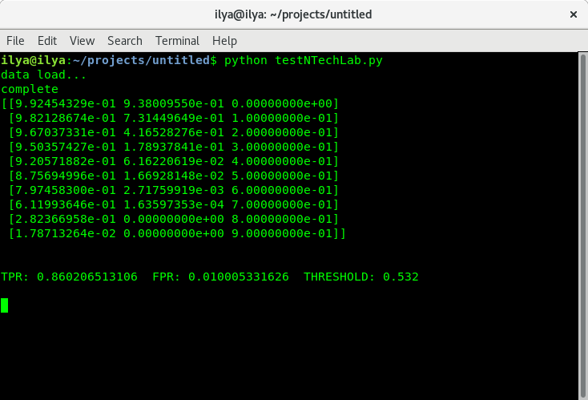
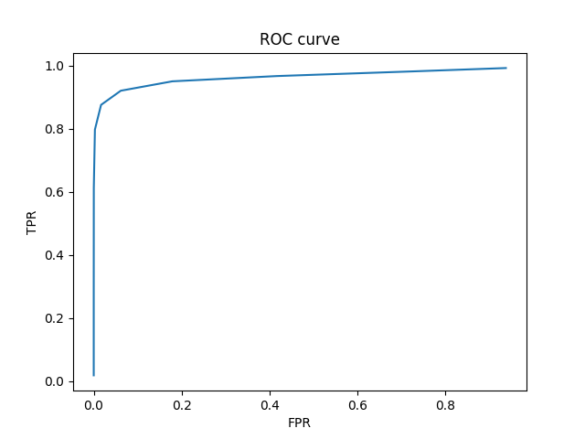

# ROC_calculation

## Info
Algorithm for calculating the roc curve and calculating the threshold for a given probability of correct recognition. The algorithm is optimized to reduce the consumption of operative memory.

### Show result

### ROC result

